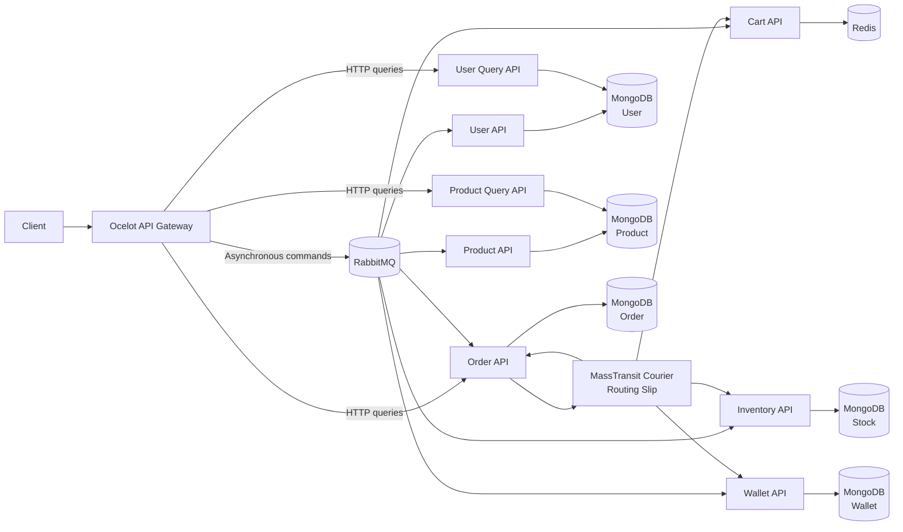
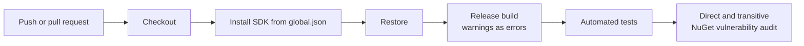

# EasyShopper

[](https://github.com/kemalyasintha/EasyShopper/actions/workflows/ci.yml)


EasyShopper is an event-driven e-commerce microservices reference project built with ASP.NET Core, MassTransit, RabbitMQ, MongoDB, Redis, and Ocelot. It demonstrates asynchronous commands, separated command/query APIs, distributed workflow coordination, API gateway patterns, caching, authentication, and automated quality gates.

The solution began on .NET Core 3.1 and .NET Standard 2.0. It has since been modernized to .NET 10, upgraded to current messaging and data-access libraries, hardened against committed secrets, and placed behind a GitHub Actions build, test, and dependency-audit gate.

> This is a portfolio and engineering reference system. It demonstrates architecture and modernization decisions; it is not presented as a production commerce platform.

## Project highlights

- Nine API projects organized around gateway, user, product, order, cart, inventory, and wallet capabilities.
- RabbitMQ messaging through MassTransit for asynchronous commands and events.
- MassTransit Courier routing slips for the multi-step order-placement workflow.
- Ocelot API Gateway for routing, aggregation, caching, and rate-limiting examples.
- MongoDB databases separated by domain and Redis-backed cart storage.
- JWT authentication with the signing key removed from committed configuration.
- CI enforcement for Release builds, compiler warnings, automated tests, and vulnerable NuGet packages.
- Eighteen projects retargeted and validated on .NET 10.

## Architecture



### Order-placement workflow

The order service builds a routing slip that coordinates four activities:

1. Process the customer's wallet transaction.
2. Allocate inventory for the requested products.
3. Update the order state.
4. Update the customer's cart.

MassTransit Courier carries the workflow variables between services and supports compensating activities when a later operation fails.

## Services

| Component | Responsibility | Primary technology |
|---|---|---|
| API Gateway | Entry point, downstream routing, aggregation, rate limiting, and asynchronous command publication | Ocelot, ASP.NET Core |
| User API | User creation commands | MassTransit, MongoDB |
| User Query API | Authentication and user reads | JWT, MongoDB |
| Product API | Product creation commands | MassTransit, MongoDB |
| Product Query API | Product reads | MongoDB |
| Order API | Order creation and routing-slip coordination | MassTransit Courier, MongoDB |
| Cart API | Cart commands and cart state | Redis |
| Inventory API | Stock allocation and release | MongoDB, MassTransit |
| Wallet API | Debit, credit, and compensation operations | MongoDB, MassTransit |
| Infrastructure | Shared contracts, messaging registration, authentication, security, and workflow activities | .NET class library |

## Modernization work

| Area | Before | Current state |
|---|---|---|
| Target frameworks | .NET Core 3.1 / .NET Standard 2.0 | .NET 10 across all 18 projects |
| SDK selection | Developer-machine dependent | Pinned through `global.json` |
| Messaging | MassTransit 6.3.2 | MassTransit and RabbitMQ transport 8.5.7 |
| API gateway | Ocelot 16.0.1 | Ocelot 25.0.0 |
| MongoDB driver | 2.10.3 | 3.11.0 with affected queries updated |
| API documentation | Swashbuckle 6.2.3 | Swashbuckle 10.2.3 where required |
| JSON serialization | Legacy Newtonsoft.Json usage | Application code migrated to `System.Text.Json` |
| Authentication | JWT key stored in configuration | Key externalized and validation hardened |
| Repository hygiene | IDE-generated files tracked | `.vs` and user-specific project files removed |
| Delivery validation | Manual local validation | GitHub Actions build, test, and vulnerability gate |

## Continuous integration

The `CI` workflow runs for pull requests and pushes to `main`:



The workflow fails when:

- the solution cannot be restored or compiled;
- the compiler produces a warning;
- any automated test fails; or
- a vulnerable direct or transitive NuGet dependency is detected.

## Run locally with Docker

### Prerequisites

- Docker Desktop with Docker Compose
- Git
- A local copy of this repository

### Start the complete stack

Copy the example environment file, replace its placeholder values with strong local secrets, and start the services:

```powershell
Copy-Item .env.example .env
notepad .env
docker compose config --quiet
docker compose up -d --build --wait --wait-timeout 240
```

All published ports are bound to `127.0.0.1` for local development. After startup, open the API Gateway Swagger UI at <http://localhost:6355/swagger/index.html>.

### Local endpoints

| Component | Local endpoint |
|---|---|
| API Gateway and Swagger | `http://localhost:6355` |
| User API | `http://localhost:6388` |
| User Query API | `http://localhost:13322` |
| Product API | `http://localhost:6406` |
| Product Query API | `http://localhost:9559` |
| Order API | `http://localhost:6420` |
| Cart API | `http://localhost:18586` |
| Inventory API | `http://localhost:14639` |
| Wallet API | `http://localhost:2016` |
| MongoDB | `localhost:27017` |
| RabbitMQ | `localhost:5672` |
| RabbitMQ management UI | `http://localhost:15672` |
| Redis | `localhost:6379` |

Check container health with `docker compose ps`. Stop the stack without deleting its persisted data by running:

```powershell
docker compose down
```

Do not add `-v` unless you intentionally want to delete the MongoDB, RabbitMQ, Redis, and data-protection volumes.

## Validate the repository

### Prerequisites

- .NET 10 SDK compatible with the version in `global.json`
- Docker Desktop with Docker Compose
- Git

Run the same checks used by CI:

```powershell
dotnet restore EShop.sln
dotnet build EShop.sln --configuration Release --no-restore --warnaserror
dotnet test EShop.sln --configuration Release --no-build --logger "console;verbosity=minimal"
dotnet list EShop.sln package --vulnerable --include-transitive
docker compose config --quiet
docker build --build-arg PROJECT_PATH=EShop.ApiGateway/EShop.ApiGateway.csproj --tag easyshopper/api-gateway:local .
```

Current checkpoint: the solution builds with warnings treated as errors, all 3 automated tests pass, the configured NuGet sources report no known vulnerable packages, the Compose definition validates, and the API Gateway container image builds.

## Runtime dependencies

Docker Compose provisions the supporting infrastructure used by the local stack:

| Dependency | Compose service | Host endpoint | Purpose |
|---|---|---|---|
| RabbitMQ | `rabbitmq` | `localhost:5672` | Commands, events, request/response, and routing-slip activities |
| RabbitMQ management UI | `rabbitmq` | `http://localhost:15672` | Local broker inspection |
| MongoDB | `mongo` | `localhost:27017` | User, product, order, inventory, and wallet persistence |
| Redis | `redis` | `localhost:6379` | Cart storage and gateway caching examples |

All published ports are bound to `127.0.0.1` for local development. Compose health checks prevent dependent services from starting before their dependencies are ready.

## Local secrets

Copy `.env.example` to `.env` and replace its placeholder values before starting the stack:

```powershell
Copy-Item .env.example .env
notepad .env
```

The `.env` file is ignored by Git. Committed configuration contains no working JWT signing key or RabbitMQ password. Production deployments should retrieve secrets from Azure Key Vault or another managed secret store.

## Repository structure

```text
EasyShopper/
|-- .github/workflows/       # CI build, test, dependency, and Docker validation
|-- .dockerignore            # Container build-context exclusions
|-- .env.example             # Local environment-variable template
|-- Dockerfile               # Reusable multi-stage .NET container build
|-- compose.yaml             # Complete local distributed stack
|-- EShop.ApiGateway/        # Ocelot gateway and async command middleware
|-- EShop.Infrastructure/    # Contracts, messaging, security, and activities
|-- EShop.User.*/            # User command, query, and persistence projects
|-- EShop.Product.*/         # Product command, query, and persistence projects
|-- EShop.Order.*/           # Order API and persistence projects
|-- EShop.Cart.*/            # Redis-backed cart projects
|-- EShop.Inventory.*/       # Inventory API and persistence projects
|-- EShop.Wallet.*/          # Wallet API and persistence projects
|-- EShop.*.Test/            # Automated test projects
|-- EShop.sln
+-- global.json
```

## Engineering decisions demonstrated

- Event-driven communication reduces direct coupling between command-producing and command-handling services.
- Command and query APIs are separated for the user and product domains.
- Routing slips coordinate a distributed business process without a shared database transaction.
- Domain-specific MongoDB databases reduce persistence coupling.
- Redis provides a fast store for short-lived cart data.
- API gateway policies centralize selected cross-cutting traffic concerns.
- CI makes build quality and dependency health visible and repeatable.

## Roadmap

- Add Dockerfiles and Docker Compose for one-command local startup.
- Replace fixed local endpoints with environment-driven service configuration.
- Expand unit and integration coverage for messaging, compensation, authentication, and persistence paths.
- Add health checks, structured logging, metrics, and distributed tracing.
- Add Testcontainers-based integration tests for RabbitMQ, MongoDB, and Redis.
- Add deployment infrastructure for an Azure-hosted demonstration environment.
- Capture a short end-to-end order workflow demo for the repository and LinkedIn Featured section.

## Author

**Kemal Yasintha**<br>
Senior Full Stack Engineer | .NET | Azure | Distributed Systems | DevOps<br>
[LinkedIn](https://www.linkedin.com/in/kemalyasintha/) | [GitHub](https://github.com/kemalyasintha)
